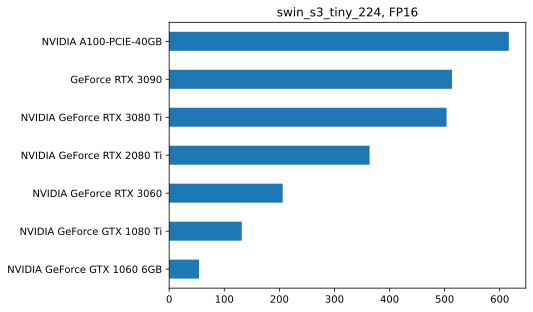
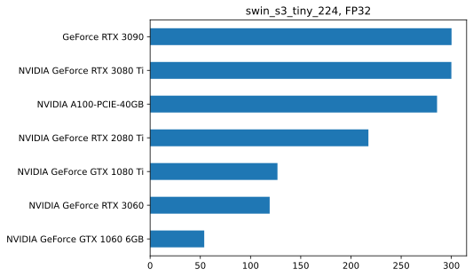
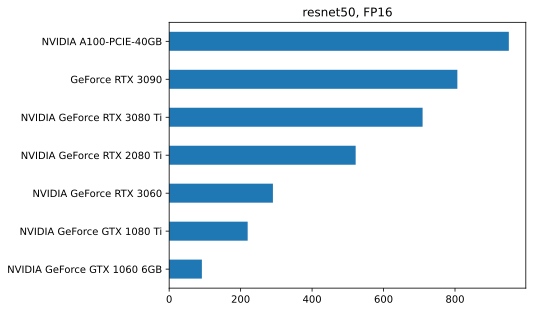
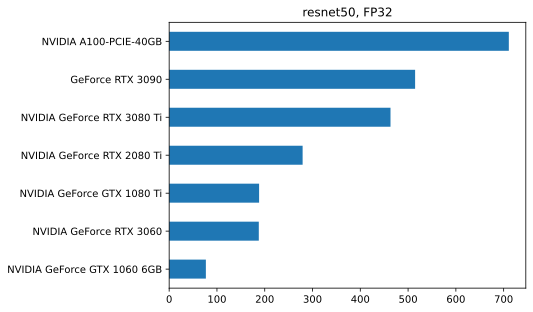

How it works
================

<!-- WARNING: THIS FILE WAS AUTOGENERATED! DO NOT EDIT! -->

# Results

## Install

``` sh
pip install gpu_sprint
```

The benchmark will attempt to

``` python
import wandb
import pandas as pd
```

``` python
api = wandb.Api()

runs = api.runs("xl0/gpu-sprint")
summaries = [ dict(r.summary) | {"id": r.id} for r in runs if r.state == "finished"]
```

``` python
```

    'qrnu6ot2'

``` python
df = pd.DataFrame.from_records(summaries)
```

``` python
# df.drop(labels=["_step", "_wandb", "pytorch", "n_batches", "n_seconds", "_runtime", "_timestamp", "n_items", "platform", "device_capability", "duration", "cuda"], axis=1)

# df = df[df.state == "finished"]
df = df[["device_name", "model", "bs", "fp16", "throughput"]]

df["fp16"] = df["fp16"].apply(lambda x: "FP16" if x else "FP32")

# df["fp"] = "FP32"
# df.loc[df.fp16 == True].fp = "FP16"
```

``` python
df.dropna(inplace=True)
```

``` python
df.fp16.unique()
```

    array(['FP16', 'FP32'], dtype=object)

``` python
from matplotlib import pyplot as plt
```

``` python
df.model.unique()
```

    array(['swin_s3_tiny_224', 'resnet50'], dtype=object)

``` python
for model in df.model.unique():
    for fp in df.fp16.unique():

        

        data = df.loc[ df.model.eq(model) & df.fp16.eq(fp) ]
        sorted_best_bs = data.groupby("device_name")["throughput"].max().sort_values()
    
        # _, ax = plt.subplot(figsize=(12, 7))

        print(len(sorted_best_bs))
        print(sorted_best_bs)        

        ax = sorted_best_bs.plot.barh(title=f"{model}, {fp}")
        ax.set_ylabel(None)
        plt.show(ax)

        # ax.yla

# df.loc[].groupby(["device_name"])["throughput"].max().sort_values().plot.barh()
```

    7
    device_name
    NVIDIA GeForce GTX 1060 6GB     54.089000
    NVIDIA GeForce GTX 1080 Ti     131.775100
    NVIDIA GeForce RTX 3060        206.076044
    NVIDIA GeForce RTX 2080 Ti     363.738718
    NVIDIA GeForce RTX 3080 Ti     503.479972
    GeForce RTX 3090               513.340434
    NVIDIA A100-PCIE-40GB          616.512926
    Name: throughput, dtype: float64



    7
    device_name
    NVIDIA GeForce GTX 1060 6GB     53.886110
    NVIDIA GeForce RTX 3060        119.061773
    NVIDIA GeForce GTX 1080 Ti     126.832900
    NVIDIA GeForce RTX 2080 Ti     217.387845
    NVIDIA A100-PCIE-40GB          285.753879
    NVIDIA GeForce RTX 3080 Ti     300.003782
    GeForce RTX 3090               300.176114
    Name: throughput, dtype: float64



    7
    device_name
    NVIDIA GeForce GTX 1060 6GB     91.577139
    NVIDIA GeForce GTX 1080 Ti     219.712027
    NVIDIA GeForce RTX 3060        290.370868
    NVIDIA GeForce RTX 2080 Ti     521.958950
    NVIDIA GeForce RTX 3080 Ti     709.301840
    GeForce RTX 3090               806.580136
    NVIDIA A100-PCIE-40GB          950.636744
    Name: throughput, dtype: float64



    7
    device_name
    NVIDIA GeForce GTX 1060 6GB     76.822656
    NVIDIA GeForce RTX 3060        187.592534
    NVIDIA GeForce GTX 1080 Ti     188.205133
    NVIDIA GeForce RTX 2080 Ti     279.292966
    NVIDIA GeForce RTX 3080 Ti     463.213333
    GeForce RTX 3090               514.710256
    NVIDIA A100-PCIE-40GB          710.835062
    Name: throughput, dtype: float64



``` python
ax
```

    <AxesSubplot: ylabel='device_name'>

``` python
data = df.loc[ df.model.eq("resnet50") & df.fp16.eq("FP32") ].groupby("device_name")["throughput"].max().sort_values() #.plot.barh(ax)
```

``` python
ax.barh(data, width=1)
```

    <BarContainer object of 7 artists>

``` python
plt.figure()
```

``` python
run = api.run("/xl0/gpu-sprint/runs/3dhy7u3r")
```

``` python
run
```

<iframe src="https://wandb.ai/xl0/gpu-sprint/runs/3dhy7u3r?jupyter=true" style="border:none;width:100%;height:420px;"></iframe>

``` python
```

    {'platform': 'Linux-5.11.0-49-generic-x86_64-with-glibc2.27',
     'device_name': 'GeForce RTX 3090',
     'bs': 256,
     'cuda': '11.6',
     'fp16': True,
     'n_seconds': 30,
     'run_number': 1,
     'pytorch': '1.12.1',
     '_timestamp': 1665552841.647719,
     '_step': 0,
     'model': 'swin_s3_tiny_224',
     '_runtime': 5.663633584976196,
     'n_batches': None,
     'device_capability': '(8, 6)'}
